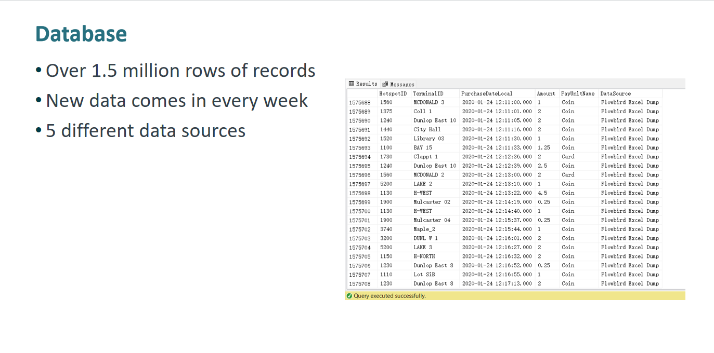
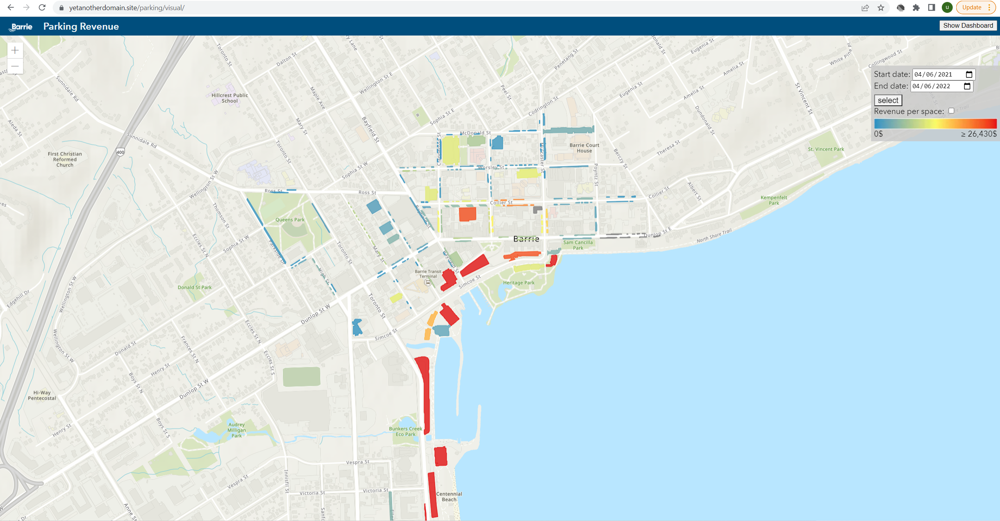

# Berrie Parking Data Integration & Visualization Project

> The code in this repo doesn't run due to all sensitive data are removed and it requires connection to certain server and database.

## Demos

<kbd></kbd>

<kbd></kbd>

## Letter of Reference from City of Barrie

[Letter of Reference from City of Barrie](./readme_assets/Letter%20of%20Reference%20Xuehao%20Xiang.pdf)  

# Gide to run the code

## Requirements:

- MS SQL Database (4GB RAM is enough)
- Ubuntu 21.10 Server Environment (2GB RAM is enough)  

> (To run this project, you must use Python 3.9, Ubuntu 21.10 has Python 3.9 by default, if you use other Ubuntu distro, you need to install Python 3.9 and switch defalut python3 to python3.9 )

> All steps bellow should be done in your Ubuntu Server

> Don't forget to open port `8000` (GIS Frontend), `8001` (GIS Backend), `8005` (Hosting Attributes file)  

## Install ODBC Driver 17 for SQL Server
You can follow the following steps or view the official documentation  
[Official Documentation Here](https://docs.microsoft.com/en-gb/sql/connect/odbc/linux-mac/installing-the-microsoft-odbc-driver-for-sql-server?view=sql-server-ver15#17)  

```
sudo su
curl https://packages.microsoft.com/keys/microsoft.asc | apt-key add -
curl https://packages.microsoft.com/config/ubuntu/$(lsb_release -rs)/prod.list > /etc/apt/sources.list.d/mssql-release.list
exit

sudo apt-get update
sudo ACCEPT_EULA=Y apt-get install -y msodbcsql17

sudo apt-get install -y unixodbc-dev
```

## Install pip 3  

`sudo apt install python3-pip`

## Setup database

1. Open code dir  
   `cd database-scripts`

2. install Python libraries  
   `pip3 install -r requirements.txt`

3. Edit ConnectionString in `db_config.py`, edit Database Address, Database Name, Username, Password to new values.

4. To init database, run:  
   `python3 init_database.py`  
   This will drop `Purchases` table if exist, then create new `Purchases` table.

5. Import historic data (this is gonna take few minutes):  
   `python3 bulk_insert_data_dump.py`

6. Start scheduled task, this script will run forever and execute task on every Monday.  
   `python3 schedule_tasks.py`

# Start GIS Visualization Backend Server

1. Open a new terminal and open code folder  
   `cd parking-gis-server`

2. Modify `db_config.py`, it should be same as `database-scripts/db_config.py`

3. Install Python libraries  
   `pip3 install -r requirements.txt`

4. Start server on 8001 port  
   `python3 wsgi.py`

# Start GIS Visualization Frontend Server

1. Open a new terminal and open code folder  
   `cd parking-gis`

2. Edid `index.js` line 7 `dataServerAddress`'s IP to your Backend Server IP address  
   (port should be same as your Backend Server's port, don't put `/` in the end of the link)

3. Start hosting static files on 8000 port  
   `python3 serve.py`

# Host ParkingDeviceListing.xlsx

1. Open a new terminal and open code folder  
   `cd ./file-hosting`

2. Start hosting static files on 8005 port  
   `python3 serve.py`
